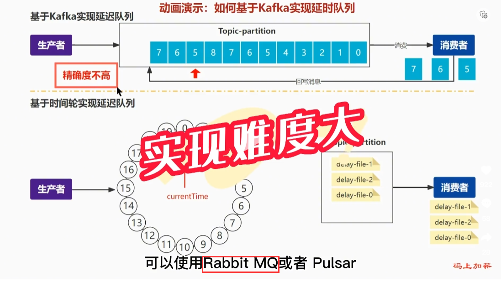
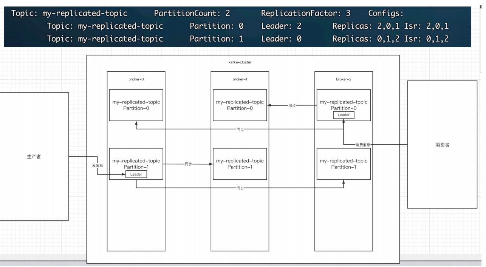

# 1、Kafka优化问题

## 1.如何防止消息丢失？

- **生产者：使用同步阻塞发送，且ack=-1/all，设置重试机制、配置min.insync.replicas>=2。**即leader+多个follower都将数据成功写入日志才返回ack。follower数量可以自己配置。
- **消费者：采用手动提交offset（同步、异步都可以）。**


## 2.**如何防⽌重复消费**

**1、出现重复消费的原因主要是生产者这边：**

采用同步发送消息的时候，发完之后会等待集群的ack，并且设有重试机制。如果在一定时间间隔内未收到该ack，那么就会进行重新发送，这就有可能导致某一条消息发送了多次。如因为⽹络抖动，没有收到broker发送的ack，但实际上broker已经收到了。此时⽣产者会进⾏重试，于是broker就会收到多条相同的消息，⽽造成消费者的重复消费。


**2、解决办法：在消费值这边**

- 做好消息接收的幂等性处理。所谓的幂等性就是多次访问的结果是一样的。对于rest的请求（get（幂等）、post（⾮幂等）、put（幂等）、delete（幂等））

==首先消费者一定是手动提交offset==

**方法一：利用数据库唯一约束实现,只能保证插入操作**。给消息的某一些属性设置唯一约束，比如增加唯一uuid，添加的时候查询是否存对应的uuid，存在不操作，不存在则添加，那样对于相同的uuid只会存在一条数据。

**方法二：**通过发送消息时加上全局ID实现，在发送消息时，给每条消息指定一个全局唯一的 ID（可以通过雪花算法去实现），消费时，先根据这个 ID 检查这条消息是否有被消费过，如果没有消费过，才更新数据。

**方法三：**使⽤**redis的分布式锁**（主流的⽅案）


## 3.**如何做到消息的顺序消费**

对于单个partition的消费顺序是可以保证的，也就是Kafka局部有序消费，因为一个partition只能被一个消费组中的一个消费者消费。但一个消费者是可以消费多个partition的。

- 生产者：消息按顺序发送到指定topic的同一个partition；

而如果要保证Kafka总体消费的有序性，就只能一个topic设置一个分区，这样就会牺牲很大的性能。

【生产者只能同步发送哦，假如异步发送就会出现消息的乱序，如第一个没有发送成功，第二第三成功了，】

因此，对于这一点总体消费的有序性，一般不用Kafka，使用rocketmq去实现才是对的。


## 4.**解决消息积压问题**

**消费者的消费速度远赶不上⽣产者的⽣产速度，**导致kafka中有⼤量的数据没有被消费。随着没有被消费的数据堆积越多，**消费者寻址的性能**会越来越差，最后导致整个kafka对外提供的服务的性能很差，从⽽造成其他服务也访问速度变慢，造成服务雪崩。

解决方案：

- 消费者能力不足，使⽤多线程，充分利⽤机器的性能进⾏消费消息

- 可以考虑增加Topic的分区数，并且同时提升消费组的消费者数量，消费者数=分区数。（两者缺一不可）

- 若是下游数据处理不及时，则提高每批次拉取的数量。批次拉取数量过少（拉取数据/处理时间 < 生产速度），使处理的数据小于生产的数据，也会造成数据积压。


## 5.延时队列的实现？

==Kakfa实现延时队列效果并不好！！！==

使用时间轮 ，和消息队列kafka没有必然关系，时间轮可以自己实现，也可以 使用别人写好的 比如 netty 封装的时间轮。




# 2、Kafka基础知识

## 1.Zookeeper 在 Kafka 中的作用知道吗？

ZooKeeper 主要为 Kafka 提供元数据的管理的功能。

从图中我们可以看出，Zookeeper 主要为 Kafka 做了下面这些事情：

1. **Broker 注册** ：在 Zookeeper 上会有一个专门**用来进行 Broker 服务器列表记录**的节点。每个 Broker 在启动时，都会到 Zookeeper 上进行注册，即到 `/brokers/ids` 下创建属于自己的节点。每个 Broker 就会将自己的 IP 地址和端口等信息记录到该节点中去
2. **Topic 注册** ： 在 Kafka 中，同一个**Topic 的消息会被分成多个分区**并将其分布在多个 Broker 上，**这些分区信息及与 Broker 的对应关系**也都是由 Zookeeper 在维护。比如我创建了一个名字为 my-topic 的主题并且它有两个分区，对应到 zookeeper 中会创建这些文件夹：`/brokers/topics/my-topic/Partitions/0`、`/brokers/topics/my-topic/Partitions/1`
3. **负载均衡** ：上面也说过了 Kafka 通过给特定 Topic 指定多个 Partition, 而各个 Partition 可以分布在不同的 Broker 上, 这样便能提供比较好的并发能力。 对于同一个 Topic 的不同 Partition，Kafka 会尽力将这些 Partition 分布到不同的 Broker 服务器上。当生产者产生消息后也会尽量投递到不同 Broker 的 Partition 里面。**当 Consumer 消费的时候，Zookeeper 可以根据当前的 Partition 数量以及 Consumer 数量来实现动态负载均衡。**




## 2.关于消费者⾃动提交和⼿动提交offset

**1）提交的内容**

消费者⽆论是⾃动提交还是⼿动提交，都需要把**所属的消费组+消费的某个主题+消费的某个分区+消费的偏移量**，这样的信息提交到集群的**_consumer_offsets主题**⾥⾯。


## 3.kafka集群中的controller.rebalance、Hw

**1.controller**

- 集群中谁来充当controller

每个broker启动时会向zk创建⼀个临时序号节点，获得的序号最⼩的那个broker将会作为集群中的controller，负责这么⼏件事：

- 当集群中有⼀个副本的leader挂掉，需要在集群中选举出⼀个新的leader，选举的规则是
- 从isr集合中最左边获得。
- 当集群中有broker新增或减少，controller会同步信息给其他broker
- 当集群中有分区新增或减少，controller会同步信息给其他broker


**2.rebalance机制**

**前提：**消费组中的消费者没有指明分区来消费，假如每个消费者指定了分区去消费，那么就不会触发。

**触发的条件：**当消费组中的消费者和分区的关系发⽣变化的时候，例如某个消费者挂掉了，它消费的那个分区现在没有人消费，通过心跳检测，

**分区分配的策略：**在rebalance之前，分区怎么分配会有这么三种策略

- range：根据公式去计算得到每个消费消费哪⼏个分区：前⾯的消费者是分区总数/消费者数量+1,之后的消费者是分区总数/消费者数量
- 轮询：⼤家轮着来
- sticky：粘合策略，如果需要rebalance，**会在之前已分配的基础上**调整，不会改变之前的分配情况。如果这个策略没有开，那么就要进⾏全部的重新分配。**建议开启。**


**3.HW和LEO**

LEO：每个副本都有这个，他是指该副本最后消息的offset位置（log-end-offset）

HW：高水位，它是指leader和follower已经完成数据同步的offset位置。消费者消费集群里面的消息时，只能消费到HW的位置，无法消费到LEO的位置，目的就是防止消息的丢失。因为有可能leader收到消息后更新了LEO，但还没有来得及给follower去同步就挂了，就会出现问题。

这个和如何防止消息丢失的配置有很多联系。


# 3、Kafka项目配置文件

```yml
# kafka
  kafka:
    # kafka集群地址
    bootstrap-servers: 192.168.100.14:9092
    # ------------ 生产者 --------------
    producer:
      # 重试次数
      retries: 3
      # ack应答级别（leader保存即可）
      acks: 1
      # 批量大小 16kb
      batch-size: 16384
      # 生产端缓冲区大小 32m
      buffer-memory: 33554432
      # kafka 提供的序列化器
      key-serializer: org.apache.kafka.common.serialization.StringSerializer
      value-serializer: org.apache.kafka.common.serialization.StringSerializer

    # ---------------consumer 消费者---------------
    consumer:
      # 消费组 id
      group-id: ynjt-jsd
      # 关闭自动提交
      enable-auto-commit: false
      auto-offset-reset: latest #:新消费组，消费新消息
      properties:
        #消费会话超时时间(超过这个时间consumer没有发送心跳,就会触发rebalance操作)
        session.timeout.ms: 20000
        #消费请求超时时间
        request.timeout.ms: 24000

      max-poll-records: 50 #长轮询poll最大消息数
      key-deserializer: org.apache.kafka.common.serialization.StringDeserializer
      value-deserializer: org.apache.kafka.common.serialization.StringDeserializer
      
    listener:
      missing-topics-fatal: false
      ack-mode: manual
      # 批量消费
      type: batch
```


